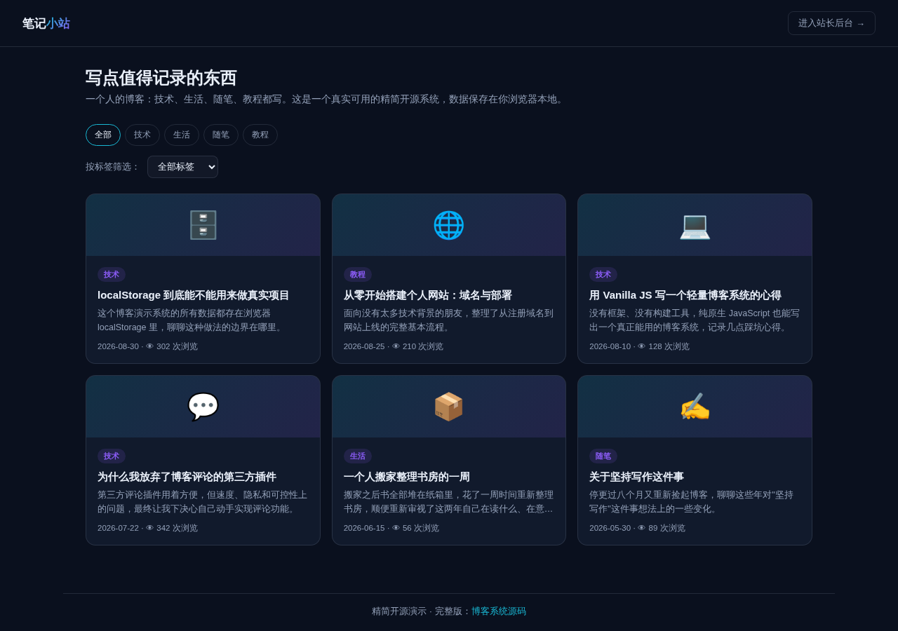

# 个人博客系统（精简开源版）· Blog Lite

**[在线体验（前台）→](https://anna123123123-creator.github.io/blog-lite/)** · **[站长后台 →](https://anna123123123-creator.github.io/blog-lite/admin.html)**

免费开源的个人博客系统精简版。这不是截图或原型图，是一个**真实可用**的前后台系统：文章浏览、分类与标签筛选、浏览量统计、评论提交与审核后才公开显示，后台文章增删改查、评论审核管理、数据看板——都是真功能，纯前端 + `localStorage` 实现，不需要服务器、不需要数据库，克隆下来打开就能用，也适合作为学习或二次开发的起点。



## 功能

**前台（读者视角）**
- 文章列表浏览（只展示已发布的文章），按分类、标签筛选
- 点开文章查看完整正文、浏览量会真实累加
- 只显示审核通过的评论；提交新评论需填写昵称和内容，提交后先进入"待审核"状态，页面提示"评论已提交，审核通过后将显示"，不会立刻公开

**后台（站长视角）**
- 仪表盘：文章总数、已发布数、总浏览量、待审核评论数，以及按浏览量排序的热门文章榜
- 文章管理：新增、编辑、删除文章（标题、Slug、摘要、正文、分类、标签、发布开关），删除文章会级联删除其下所有评论
- 评论管理：查看全部评论并关联所属文章，按"待审核 / 已通过"筛选，一键通过或删除评论

## 试用方法

克隆下来，直接用浏览器打开 `index.html`，或用静态文件服务器跑起来：

```bash
python3 -m http.server 8000
```

前台在 `index.html`，后台在 `admin.html`。所有数据存在浏览器的 `localStorage` 里（`blog_lite_data_v1` 这个 key），后台侧边栏有"重置示例数据"按钮可以随时清空重来。

## 技术说明

没有用任何框架或构建工具，纯原生 HTML/CSS/JavaScript，一共 4 个文件：`data.js`（数据层，负责 localStorage 读写和种子数据）、`index.html` + `script.js`（前台）、`admin.html` + `admin.js`（后台）。因为是纯前端 Demo，数据只存在当前浏览器里，不同设备/浏览器之间不会同步，也没有真正的登录鉴权——真实生产系统需要一个后端 API 和数据库来替换 `data.js` 里的存储层，并加上多作者账号体系，其余的界面和交互逻辑基本可以直接复用。

## 协议

MIT，随便怎么用都行。

## 需要定制版？

这个工具免费开源、可以直接用。如果你需要的是**改造成适合自己业务的版本**——换品牌、改字段、加功能、接后端或数据库——我可以做。

- **交付周期**：3–10 个工作日
- **交付内容**：完整源码（不加密、可自行二次开发）+ 在线地址 + 部署说明
- **已有 49 套现成系统**可直接改造，覆盖电商、教育、门店、内容、跨境等行业：[全部清单与在线演示](https://inzyxuashop.com)

把你的需求发给我，24 小时内回复可行性与报价：**evcdecd@gmail.com**
